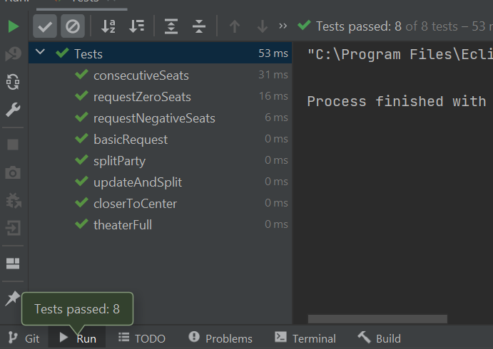

# MovieTheaterSeatingChallenge

**Challenge Overview:** <br/>
This program is an algorithm for assigning seats within a movie theater to
fulfill reservation requests. The movie theater has the seating
arrangement of 10 rows x 20 seats. This program maximizes both customer satisfaction and customer
safety. For the purpose of public safety, assume that a buffer of three
seats and/or one row is required.

**Programming Language:** 
Java

**Input Description:** <br/> 
The input should be a file that contains one line of input for each
reservation request. The order of the lines in the file reflects the order in
which the reservation requests were received. Each line in the file will be composed of a reservation identifier, followed by a space, and then the
number of seats requested. The reservation identifier will have the
format: R####. For example: 

``` 
R001 2
R002 4
R003 4
R004 3
```

**Output Description:** <br/> 
The program outputs a file containing the seating assignments for
each request. Each row in the file includes the reservation number
followed by a space, and then a comma-delimited list of the assigned
seats. For example:

```
R001 I1,I2
R002 F16,F17,F18,F19
R003 A1,A2,A3,A4
R004 J4,J5,J6
```

**Assumptions:** <br/> 
- The reservations are processed in order, and seat assignments cannot be changed once they are assigned.
- When there's not enough seats for a reservation, the program outputs the assigned seats and rejects the reservation and its following reservation(s).
- The algorithm is based on assumptions of customers' satisfaction: closer to the center is better; sitting in consecutive seats is better than splitting for a single reservation.
- The safety guidelines are only between parties, i.e. the members of a party do not need to follow the guidelines, even when they are split.
- The program does not maximize seat utilization.


**Program Overview:** <br/>
1. To maximize customer satisfaction, the program minimizes the distance between the assigned seats and the center of the theater.
2. The program prioritizes consecutive(in same row) seats, and when there does not exist any consecutive seats, the party will be recursively split in halves while minimizing their distance from the center of the theater.

**Folder Structure:**<br/>
``` 

├── src                              # contains all class files and test files 
    ├── Main.java                       # Main class, the starting point of the program
    ├── MovieTheater.java               # MovieTheatre class, the main logic is performed
    ├── Tests.java                      # Tests class, testing is performed in this class
├── io                                  # contains all the input and output files
├── junit-4.13.2.jar                    # jar file used for junit testing
├── hamcrest-core-1.3.jar               # jar file was used as a dependency for JUnit
├── MovieTheatreSeatingChallenge.iml    # is a module file created by IntelliJ IDEA
├── testresults.PNG                     # image showing the testcases 
└── README.md                           # This file is for the description of the project.

``` 

**How to Run The Program:** <br/>
First, open your terminal and navigate to the `src` folder of the project, and run the following command to compile the program: 

``` 
javac Main.java 
```

Then, use the following command to run the program:

``` 
java Main [inputfilepath]

```
For example: 

``` 
java Main D:\MovieTheaterSeatingChallenge\io\input1.txt

```

The program will take a complete path to the input file. Then, the program will execute and store the outputs in a `.output` file in the same path as the input file, and it will also print the complete path of the output file.
For example:

```
java Main [your_directory]/input1.txt
The output for the program is found at : 
[your_directory]/input1-output.txt
```

### Steps to run JUnit tests 


Open your terminal window / command prompt.
Navigate to the folder "src".
To compile, run the command:
  ```
   javac -cp C:\MovieTheaterSeatingChallenge\src\main.jar:.C:\MovieTheaterSeatingChallenge\src\junit-4.13.2.jar C:\Mov
ieTheaterSeatingChallenge\src\Tests.java
  ```  
(Here -cp defines the classpath link to the jar on your local drive.)
To execute test cases, run the command:
  ```
   java -cp C:\MovieTheaterSeatingChallenge\src\main.jar:.C:\MovieTheaterSeatingChallenge\src\junit-4.13.2.jar C:\Mov
ieTheaterSeatingChallenge\src\Tests
```

Here I am using IntelliJ IDE, so I added the jar files as libraries to the project. 
Tested the setup by running tests in IDE. Below is the results of tests

